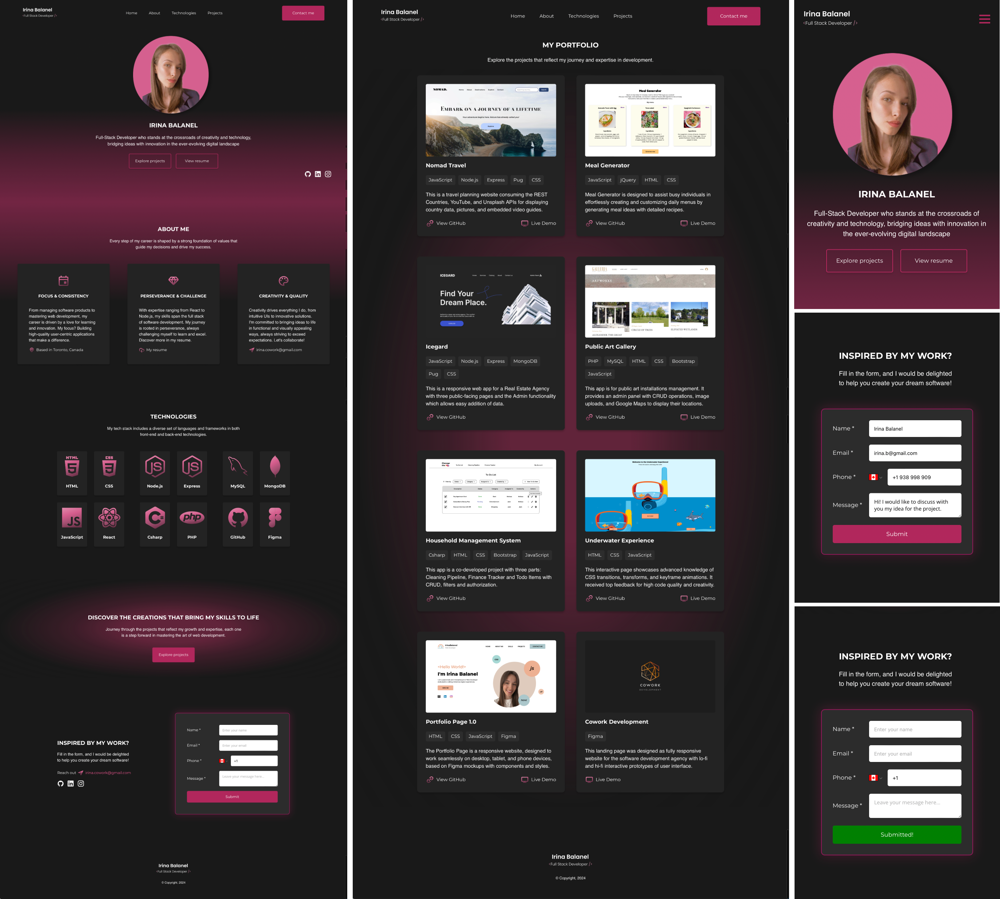

# Personal Portfolio Website

## Description

This project involves developing a responsive portfolio website using the MERN stack (MongoDB, Express, React, Node.js).

### Backend

The backend is implemented using Express and Node.js. It connects to a MongoDB database hosted on Atlas through the MongoClient library, enabling seamless interaction with the database. The backend handles several key API endpoints responsible for fetching and returning data such as projects and skills in JSON format, as well as processing contact form submissions.

### Frontend

The frontend, built with React, interacts with the backend API to fetch real-time project and skill data stored in MongoDB, ensuring that the displayed content is always current. It incorporates custom CSS and original designs created in Figma, providing a unique and visually appealing user interface. The frontend also includes visual feedbacks while hovering over or when the form is submitted, enhancing the user experience. Conditional rendering is used for project cards, where a “Live Demo” link is displayed only if the project is deployed. Additionally, the frontend is fully responsive, adapting seamlessly to different screen sizes and devices, ensuring an optimal user experience across all platforms.

## Technologies

- MongoDB - Node.js - Express.js - React - HTML - CSS - Media Queries for responsiveness

## User Interface

